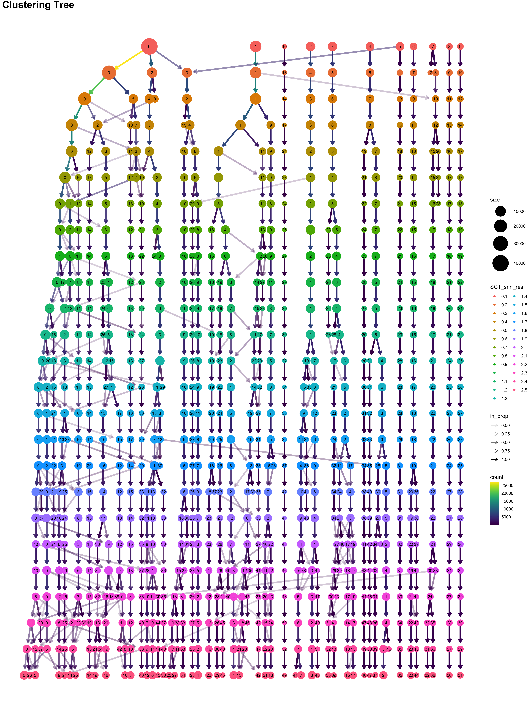
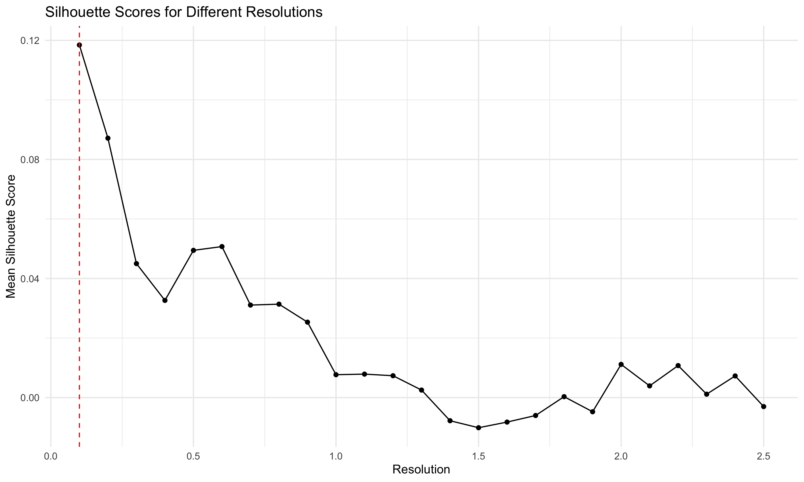
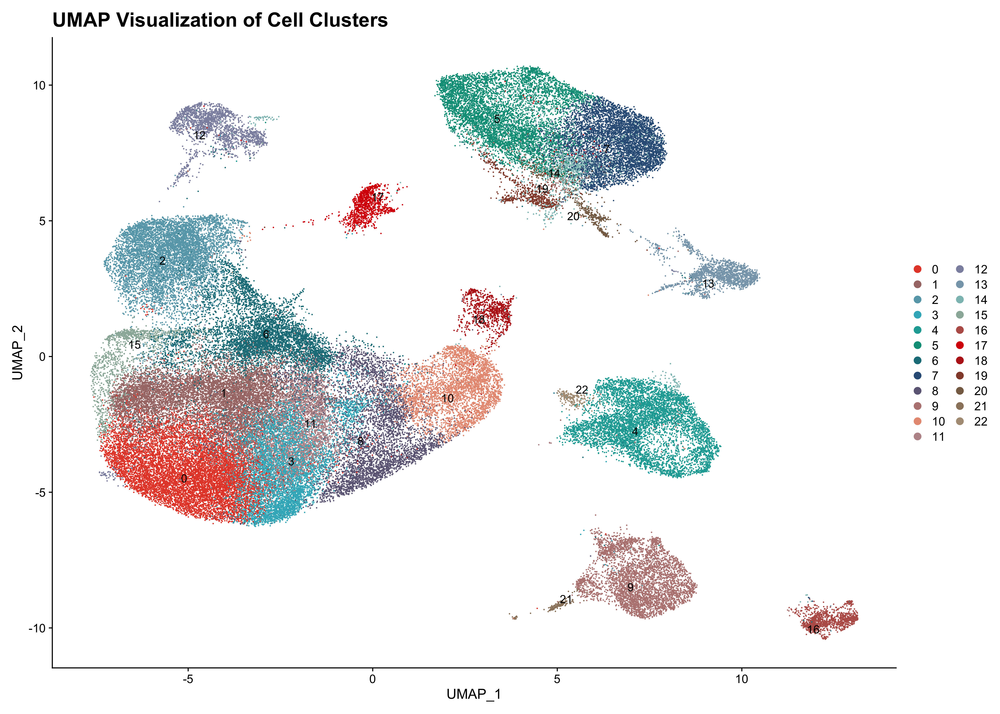

  Clustree gave us the optimal resolution of *1.5* for further analysis

- ### The Seurat analysis yielded 23 clusters, whose quality was evaluated using the silhouette score.

- ### Top Gene Expression Markers in each Cluster,

# Cluster Annotation
### The clusters were annotated using two mouse datasets, SingleR and ImmGen, along with manual annotation based on marker genes. This process led to the identification of 7 final clusters.
### UMAP Plots (SingleR)

<table>
  <tr>
    <td>
      <strong>SingleR Mouse-dataset UMAP Plot</strong> 
      
    </td>
    <td>
      <strong>ImmGen UMAP Plot</strong> 
      
    </td>
  </tr>
</table>

### 🌟Celltypes:

- 1. Epithelial Cells (Epcam, Krt8, Krt18)
- 2. Endothelial Cells (Cldn5, Rgs5)
- 3. T Cells (3d3d, Foxp3, Lag3)
- 4. B Cells (Cd79a)
- 6. Myeloids (Mrc1, Tgfb1, Cxcl12, Antxr1)
- 7. Dendritic Cells (DCs) (Cd1c, Lamp3)
- 8. Fibroblasts (Fap, Pdpn, Cd248, Pdgfra, Pdgfrb, Sema3c) 
- 9. Others

# Marker Genes Feature plots

## Final Umap

