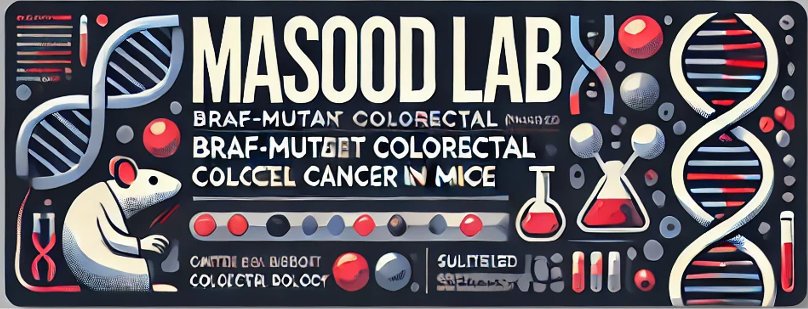

# 🧬 CellRanger Analysis for Visium FLEX Mouse Data



## 📚 Table of Contents
- [Project Overview](#-project-overview)
- [Data Description](#-data-description)
- [Requirements](#️-requirements)
- [Directory Structure](#-directory-structure)
- [Usage](#-usage)
- [Script Details](#-script-details)
- [Sample Information](#-sample-information)
- [Output](#-output)
- [Customization](#️-customization)
- [Troubleshooting](#-troubleshooting)
- [Support](#-support)
- [Project Affiliation](#-project-affiliation)

## 🔬 Project Overview


This project, led by **Ateeq Khaliq** for **Heather's Syngenic Mouse Models**, focuses on analyzing spatial transcriptomics data from mouse samples using the Visium FLEX platform. The study aims to investigate gene expression patterns in various conditions, including vehicle-treated and inhibitor-treated samples from both male and female mice.

## 📊 Data Description

- **Organism**: Mouse (Mus musculus) 🐁
- **Experiment Type**: Visium FLEX spatial transcriptomics
- **Sample Types**: 
  - Vehicle-treated female mice
  - Inhibitor-treated female mice
  - Vehicle-treated male mice
  - Inhibitor-treated male mice
- **Total Samples**: 15 (8 vehicle-treated, 7 inhibitor-treated)
- **Data Format**: FASTQ files from Illumina sequencing

## 🛠️ Requirements

- Access to a SLURM-based HPC system
- CellRanger (version 7.2.0) installed and accessible as a module
- Sufficient storage space for CellRanger output (>500GB recommended)
- Input data:
  - FASTQ files from your Visium FLEX experiment
  - Mouse reference genome (mm10)
  - Visium FLEX probe set file for mouse

## 📁 Directory Structure

```
/N/project/cytassist/heather/Chrm_499_OHagan_IUB_FLEX15_Mouse_May2024/
├── cellranger-slurm-script.sh
├── Chrm_499_OHagan_IUB_FLEX15_S1_L00[7-8]_[R1,R2,I1,I2]_001.fastq.gz
└── data/
    └── external/
        ├── reference/
        │   └── refdata-gex-mm10-2020-A/
        └── probe_set/
            └── Chromium_Mouse_Transcriptome_Probe_Set_v1.0.1_mm10-2020-A.csv
```

## 🚀 Usage

1. Save the script as `cellranger-slurm-script.sh` in your project directory.

2. Make the script executable:
   ```bash
   chmod +x cellranger-slurm-script.sh
   ```

3. Submit the job to SLURM:
   ```bash
   sbatch cellranger-slurm-script.sh
   ```

## 📝 Script Details

The script performs the following steps:

1. Changes to the project directory
2. Loads the CellRanger module (version 7.2.0)
3. Creates a configuration file (`cellranger_config.csv`) with:
   - Paths to mouse reference genome and probe set
   - FASTQ file location
   - Sample information and probe barcode IDs for all 15 samples
4. Runs CellRanger multi using the generated configuration file

## 🧪 Sample Information


| Sample | Treatment | Sex | Sample ID | Barcode |
|--------|-----------|-----|-----------|---------|
| 1-3 | Vehicle | Female | 968, 966, 979 | BC001-BC003 |
| 4-6 | Inhibitor | Female | 963, 975, 964 | BC004-BC006 |
| 7-10 | Vehicle | Male | 960, 978, 969, 983 | BC007-BC010 |
| 11-15 | Inhibitor | Male | 0, 959, 965, 967, 977 | BC011-BC015 |

## 📦 Output

- Main output directory: `Chrm_499_OHagan_IUB_FLEX15_run6` (or similar)
- SLURM logs: `cellranger_multi.out` and `cellranger_multi.error`
- Configuration file: `cellranger_config.csv`

## ⚙️ Customization

- Adjust SLURM directives (`--time`, `--mem`, `--cpus-per-task`) as needed
- Modify sample information if your experiment setup differs

## 🔧 Troubleshooting

- Check `cellranger_multi.error` for job failure details
- Verify all paths in the script
- Ensure probe barcode IDs match your experimental setup

## 📞 Support

- **Project Lead**: Ateeq Khaliq
- **Local Support**: Let me Know if you FIND them! 
- **CellRanger Issues**: [10x Genomics Support](https://support.10xgenomics.com/)

## 🏢 Project Affiliation

This work is part of **Heather's Syngenic Mouse Models** project, focusing on scRNA-seq transcriptomics analysis of mouse tissue samples to investigate gene expression patterns in various experimental conditions.

---

<p align="center">
  Made with ❤️ by Ateeq Khaliq
</p>
