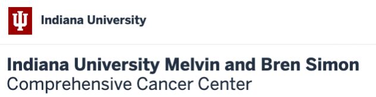

# 🧬 Therapy-induced Transdifferentiation in BRAF Mutant Colorectal Cancer

## 👩‍🔬 Principal Investigator
**Dr. Ashiq Masood, MD**
- Associate Professor
- Indiana University School of Medicine
  
**Dr. Heather M. O'Hagan, Ph.D.**
- Associate Professor of Medical and Molecular Genetics
- Indiana University School of Medicine

## 🏢 Institutional Affiliations

<table>
  <tr><td></td>
  
  </tr>
</table>

## 🎯 Research Objectives

1. Understand how BRAF plus EGFR inhibitor treatment alters tumor composition in BRAFV600E colorectal cancer
2. Identify cell populations that can be therapeutically targeted to improve therapy response

## 🧫 Key Findings

- BRAF mutant colorectal cancer is enriched for enteroendocrine cells (EECs)
- EECs are important in therapy-induced transdifferentiation
- BRAF plus EGFR inhibition promotes EEC differentiation

## 🔬 Methodology

- **Model**: Syngeneic orthotopic model of metastatic BRAFV600E colorectal cancer
- **Treatment**: Encorafenib (BRAFi) + Gefitinib/Cetuximab (EGFRi)
- **Analysis**: FLEX single-cell RNA sequencing

## 📊 Experimental Design

- Total Samples: 15
  - 8 Vehicle-treated (4 male, 4 female)
  - 7 Inhibitor-treated (4 male, 3 female)

## 🔍 Research Goals

1. Identify cell types present (cancer cells, immune cells, CAFs)
2. Determine changes in cell type proportions with treatment
3. Analyze signaling changes induced by treatment
4. Select samples for spatial transcriptomics

## 🌟 Significance

This research aims to improve treatment outcomes for patients with metastatic BRAF mutant colorectal cancer by understanding therapy-induced cellular changes and identifying new therapeutic targets.

## 📚 Related Publications

- Miller SA, et al. Cancer Research 2021 (LSD1 sensitivity in BRAF mutant colorectal cancer)
- Margonis GA et al. 2018 (Poor overall survival in metastatic BRAF mutant colorectal cancer)

## 🤝 Collaborations and Support

We welcome collaborations and are grateful for the support of:
- Indiana University School of Medicine
- IU Melvin and Bren Simon Comprehensive Cancer Center

## 📞 Contact Information

For more information about this research, please contact:

**Dr. Ateeq Khaliq**  
**Dr. Ashiq Masood**  
**Dr. Heather M. O'Hagan**   
Indiana University School of Medicine

---

  Advancing colorectal cancer research through innovative approaches in cellular biology and genetics

